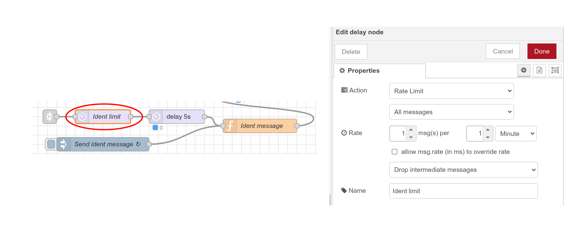
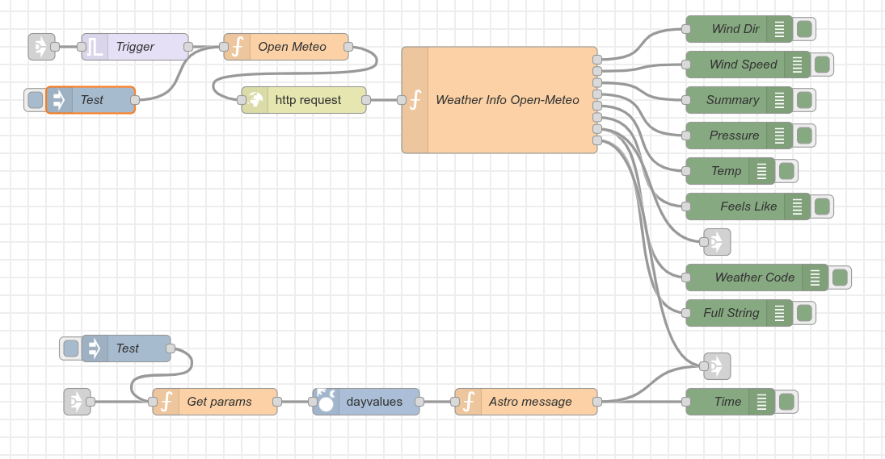
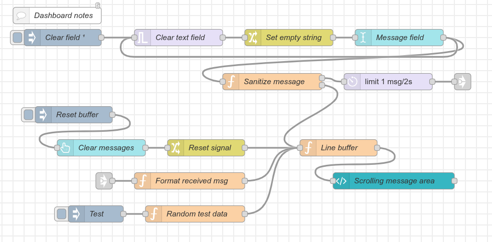
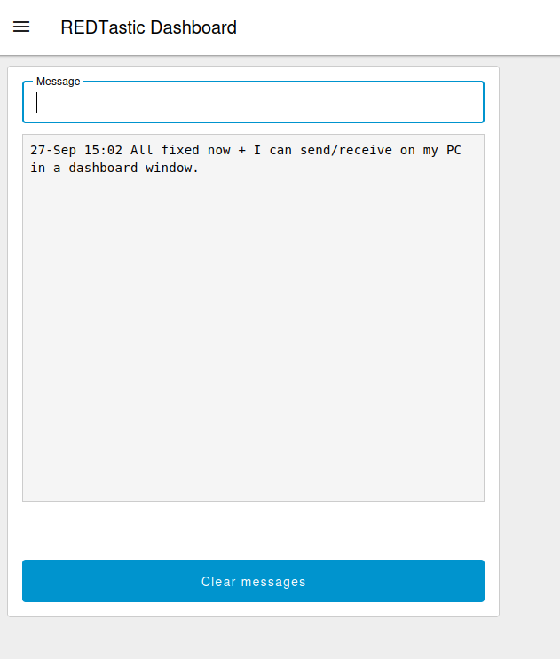
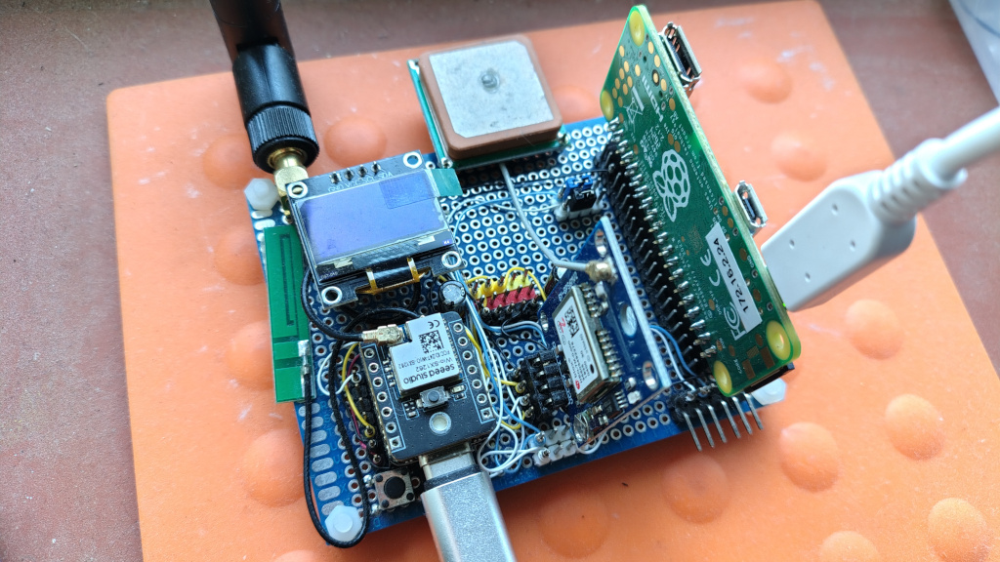
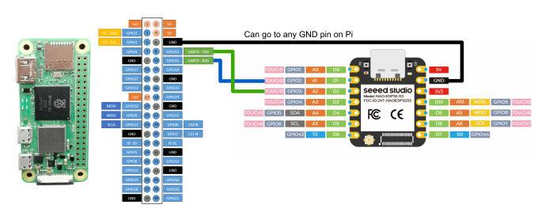
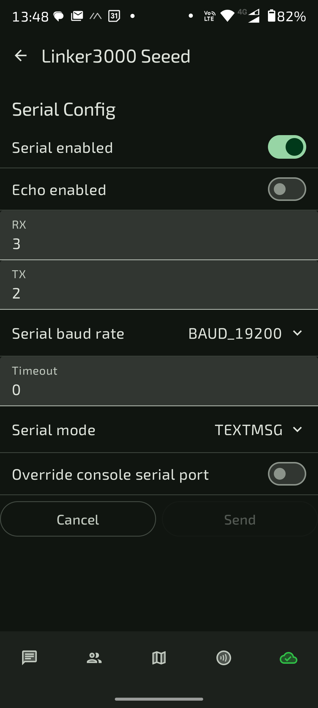
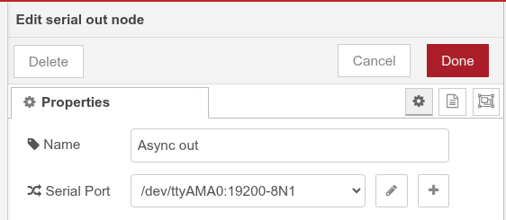
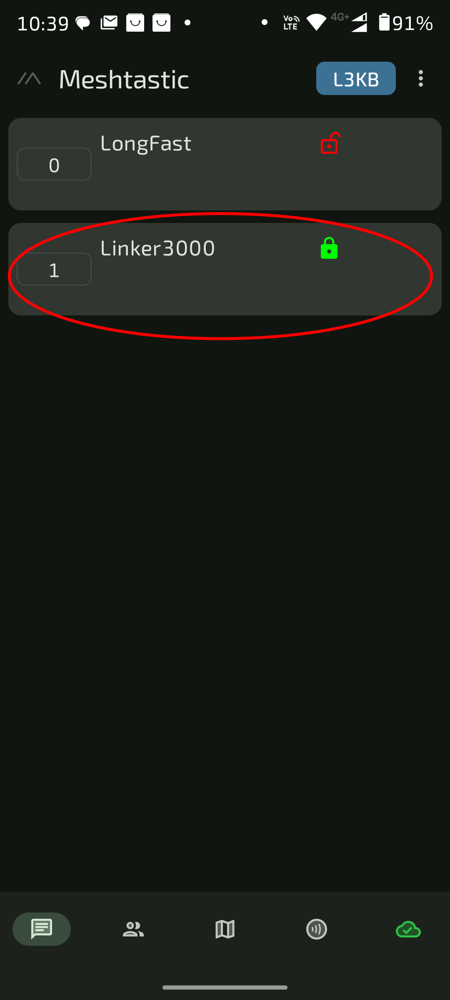

# MeshBop
A simple messaging service for Meshtastic, written as a set of Node-RED flows.

*The accuracy and results of using this app depend on your setup work and third party code.
This app is supplied 'as is'. Use at your own risk. No responsibility is accepted for 
consequential loss or errors. Feedback is welcome at the address below or via the Issues tab.*

```
Author:	Linker3000 (linker3000@gmail-dot-thingy)
License: Creative Commons Attribution-NonCommercial-ShareAlike 4.0 International CC BY-NC-SA 4.0)
 
You are free to:
  - Share — copy and redistribute the material in any medium or format
  - Adapt — remix, transform, and build upon the material
 
 Under the following terms:
  - Attribution — You must give appropriate credit.
  - NonCommercial — You may not use the material for commercial purposes.
  - ShareAlike — If you remix, transform, or build upon the material, you must distribute your contributions under the same license.
 
Full License Text: https://creativecommons.org/licenses/by-nc-sa/4.0/
```
---

**Beta 1-4 fix - changeme**

To make the checks for 'ping' and 'test' messages case insensitive, change these two lines in the function *Parse Rx message* on the first tab:

```
 { regex: new RegExp("(test|testing)$", "i"), desc: "test pattern" },        // Output 7
 { regex: new RegExp("ping$", "i"), desc: "ping pattern" },                  // Output 8
```

Adding ```, "i"``` makes the checks ignore case. In Beta 0.05 onwards all checks will ignore case.

---

**Beta 0 fix - changeme**

If you've already downloaded and installed the beta code, here's a fix to stop one ident message being sent for every news article.

Add a delay node before the *delay 5s* node on the setup tab, and set its parameters as per the image below. 
Once done, hit Deploy. This fix is not needed for beta code 0.01 (filename *-beta001) onwards.

<div align="center">

</div>
---

This package installs a set of muti-tab flows that comprise a trigger/response messaging service for Meshtastic using the Meshtastic TEXTMSG method of message sending and receiving. There is also a dashboard page for sending and receiving messages.

The setup PDF contains mostly the same info as below, so it is not an essential download. 

**Weather flow**
<div align="center">

</div>

**Dashboard flow and dashboard**
<div align="center">

</div>
<div align="center">

</div>

The default setup includes:

+ A send / receive messaging dashboard.
+ A BBC RSS news feed.
+ An inspirational (Zen) message.
+ Local weather.
+ Local time.
+ Severe weather warnings.
+ A help page.
+ An app info page.

Setting up a messaging system requires a Meshtastic node device to which there’s access to the serial (async) Tx and Rx pins, and a compute device with a serial port  (UART) that can run Linux and Node-RED.

**Important: Meshtastic firmware (currently) sends and receives TEXTMSG messages to / from the first (primary) Meshtastic channel, so if you want to use this application in a private group, that group MUST be set as the FIRST channel on the Meshtastic node hooked up for messaging. Further notes below.**

The hardware used to develop this app comprises a Seeed studios XIAO ESP32 + SX1262 Meshtastic kit and a Raspberry Pi Zero 2W. It’s an easy build because there is a script for the Pi that sets up most of Node-RED. This documentation is based on that hardware. Note that the board in the picture below is used for development and Meshtastic testing; it includes GPS, sensors and a display – it’s much more complex than just what’s needed for this project, so don’t let it put you off!

<div align="center">

</div>

## How to set up the hardware and Node-RED
The main setup steps when using a Raspberry Pi are:

1. Put an OS on an SD card (8GB min, 16GB recommended) for the Raspberry pi (minimal OS install is requi – no graphical interface).
2. Enable the async (UART) port on the Pi. Further notes below.
3. Run the official automated script to install Node-RED. When asked whether to install any Pi-specific nodes or functionality, reply Yes. Further notes below.
4. Install the needed Node-RED plugins – there’s a list below.
5. Enable TEXTMSG mode on your Meshtastic Node. (Note: You need to have physical access to the serial / async port pins on your node.) and make a note of its comms parameters, especially the speed, which is probably 19200 bits/second.
6. With the Pi and the Node shut down and powe off, connect a wire between the 0V/GND pins on the Pi and the Meshtastic node.
7. With everything still powe off, connect the Pi Rx and Tx async pins to the Node’s async pins – remembering that the wiring needs to be crossed over so, Rx on one device goes to Tx on the other and vice versa.
8. Download and import the flow code into Node-RED, which sets up all the tabs etc.
9. Check/setup the *Async in* and *Async out* nodes – further notes below and see the notes in the setup function block on the first Node-RED tab. Leave the *Async out* node disabled until all other configuration is done and tested.
10. Run through all the notes and settings in the setup function block at the top of the first tab in Node-RED*.
11. Run through the tabs in sequence, checking for a comments node, and checking all function nodes for additional setup help and info*.
12. Customise any other messages (either in the setup function or in separate function blocks) as needed.
13. Test all functions using the debug triggers.
14. Enable the *Async out* node and test again in a private channel. Further notes below.
15. Test and test again.
16. 'Go live'.

Most of the hard work is done inside Node-RED. As much of the setup as possible is done in a function node on the first tab and there are comprehensive notes in many of the function nodes – check them out to complete any setup before going live. Some tabs also have additional comments.

*The default setup uses a trigger of ‘l3k_’ for received messages so, for example, a Zen quote is sent out if the message /l3kz is received. You can change this by altering the *basePattern* global variable in the global variable function and adjusting the help test message on the Help tab.
If *basePattern* is not changed, or it’s left unset, the parser will use /l3k by default.

Some of the flows have rate limiting nodes – please respect the Mesh and leave these set to reasonable values to avoid letting people flood the channel with, for example, Zen quotes or ping requests. 

If you are testing your setup in a private channel, or with the *Async out* node disabled, there is an inject node on the first tab to reset the rate limiters. Try this if you suddenly find that outbound messages are not being generated as expected.

By default: 
+ MeshBop sends an ident message every 24 hours at 0700.
+ Severe weather alerts are checked for and issued every hour.

**NB: There is currently (Sep 2025) a bug in the Meshtastic TEXTMSG code which means that a small string of garbage data from an unclea buffer might be sent when the node is powe on (and sometimes off) – this is a Meshtastic thing so please do not report it as a MeshBop bug.**

## Other Setup Notes
### Device wiring
The wiring between the computer board and the Meshtastic NODE will depend on what devices are used. The development setup comprised a Raspberry Pi Zero 2W connected to a XIAO ESP32S3 & Wio-SX1262 Kit for Meshtastic & LoRa as follows:

<div align="center">

</div>

The pins on the XIAO board marked RX and TX weren’t used in this case because they were hooked up to a GPS module. This wiring meant that the serial setup in the Meshtastic was as follows:

<div align="center">

 <P></P>
</div>

Unless arranged differently by the hardware setup, the Pi and Seeed boards still need their own, separate USB power supplies.

### Importing the MeshBop package into Node-RED
1. Download the MeshBop *.json package from this repo.
2. Open the Burger Menu in Node-RED (top right) and select Import.
3. Choose *select a file to import*.
4. Select the downloaded .json file.
5. Click *Import*.
6. Click Deploy.

#### Global Config Error
If you receive the message: *The workspace contains some unknown node types: global-config*, try the following:
1. Click *Deploy*.
2. Click *Search for unknown nodes*.
3. Select the *global-config* node – notice that it is displayed with a flashing border in a list on the right side of the screen.
4. Double-click the node with the flashing border.
5. Select *Delete*.
6. Select *Deploy*. The deploy should now work and it’s time to start configuring your flows.

### Async ports
How to enable the serial module (async port) and set TEXTMSG mode on set a meshtastic node 

https://meshtastic.org/docs/configuration/module/serial/

NB: Do NOT enable *Override Console Serial Port*.

How to enable the async port on a Raspberry Pi (needs config files changed)

https://www.raspberrypi.com/documentation/computers/configuration.html#configure-uarts

Example modified boot config file - /boot/firmware/config.txt:

Typically at the end of the file:

```
[all]
enable_uart=1
dtoverlay=uart0
dtoverlay=disable-bt
```
As might be deduced, enabling uart async requires Bluetooth to be disabled.

Note: Raspberry Pi configurations normally use UART0 for their async port, which usually (but not always) translates to ttyAMA0 in Linux-speak – hence the default setup of the Node-RED *Async in* and out nodes:

<div align="center">

</div>

### Installing Node-RED on a Raspberry PI
https://nodered.org/docs/getting-started/raspberrypi

### Node-RED plugins
Use the *Manage palette* menu to ensure the following plugins are installed before you import the MeshBop code. Some of these nodes will be installed by default. If you are NOT using a Raspberry Pi, you should identify whether any different plugins are needed to access the serial port on your device. Not all of these plugins may be being used in the current app.
NB: Make sure you install the Flowfuse dashboard (dashboard 2):

    • flowfuse/node-red-dashboard
    • node-red-contrib-astrodata
    • node-red-contrib-buffer-parser
    • node-red-contrib-feedparser-simple
    • node-red-node-email
    • node-red-node-ping
    • node-red-node-serialport
### Testing / Using in a Private Meshtastic Channel
**Reminder: Meshtastic firmware (currently) sends and receives TEXTMSG messages to / from the first (primary) Meshtastic channel, so if you want to use this application in a private group, that group MUST be set as the FIRST channel on the Meshtastic node hooked up for messaging.**

To do this is a three-step process in the Meshtastic phone app:
1. Set up a new channel as your private channel – by default, this is known as a ‘secondary’ channel, however we will move its order – see link below for how to set up a secondary (private) channel.
2. In the Radio Configuration for the node being used, drag the new private channel to be the first one in the list, then save and wait for the node to reboot. In other words the secondary (private) channel now becomes the primary channel on this node.
3. Configure another Meshtastic node to work with this private channel. Provided the config is done correctly, this can be left as a secondary channel – it does not have to be moved to be the first one in the channel list, but you must select it as the one for messaging.
Use this other Meshtastic node for testing - remembering to enable the *Async out* node on the first tab in Node-RED so that messages go out.

<div align="center">

</div>

### How to set up a Secondary (private) Channel.
https://meshtastic.org/docs/configuration/radio/channels/
Once all testing is done, there are two options:
1. Leave the channel order as it is on the messaging node and all the good things will happen in this private channel.
2. Use the Radio configuration menu to change the channel order back to the original order, which makes the LongFast (public) channel the default – which is the one to/from which all MeshBop messaging takes place.

In other words, if channel order is swapped back to the default, everything sent by MeshBop goes to the public (LongFast) messaging channel. 

***Make sure that’s what you want to do!***

MeshBop rate limits its sending so there is reduced risk of flooding the public channel, but you may not want to accidentally send any personal information to the wrong channel.

## Upgrading MeshBop
Upgrading MeshBop is done by repeating the initial installation steps. Unfortunately, at the moment at least, there is no way to backup the current settings before upgrading, so if any functions have been edited, it is best to copy their entire code into a text editor and save this. When an upgrade has been done, the saved info can be used to re-setup the new functions. Before doing a complete copy/paste though, check out the new function code because it may have been upgraded and work differently. 

The upgrade process is as follows:
1. Take a copy of any modified functions, as described above.
2. If any flows have been modified by, for example, adding nodes, consider taking a screenshot of the wiring so that the same changes can be applied to the upgrade.
3. Before importing an upgrade, take MeshBop offline – for example, disable the async out node or move the primary message channel its using to be the secondary.
4. Export and download a copy of the current setup. This is done via the *Export* option in the burger menu (top right). Remember to select that you want to export *All flows*.
5. Delete all but one of the current flow tabs (the last tab in Node-RED can’t be deleted): Double click each tab in turn and select *Delete*.
6. Select the final tab, press CTRL-A to select all nodes and press the keyboard’s *del* key..
7. Double click on the tab name and rename the tab to ‘Delete me’.
8. Do a *Full* deploy from the *Deploy* menu.
9. Download the new *.json file from the GitHub repository and import it as described earlier. Confirm that changes should be merged, if asked.
10. Delete the tab named ‘Delete me’.
11. Check through the new code, reading all the comments and reviewing all the functions.
12. Use the saved notes to re-make any function or wiring changes done previously.
13. Test as described above for the original import
14. Test everything before going live.
