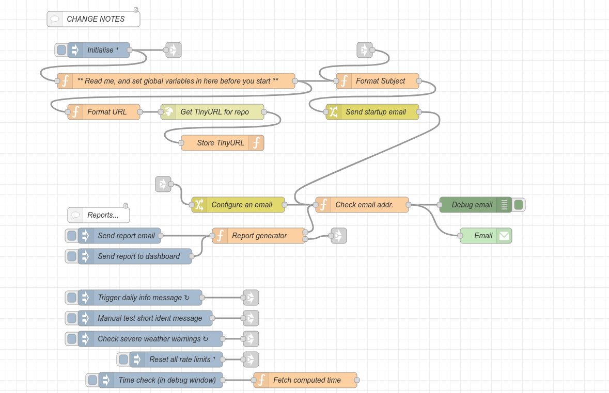
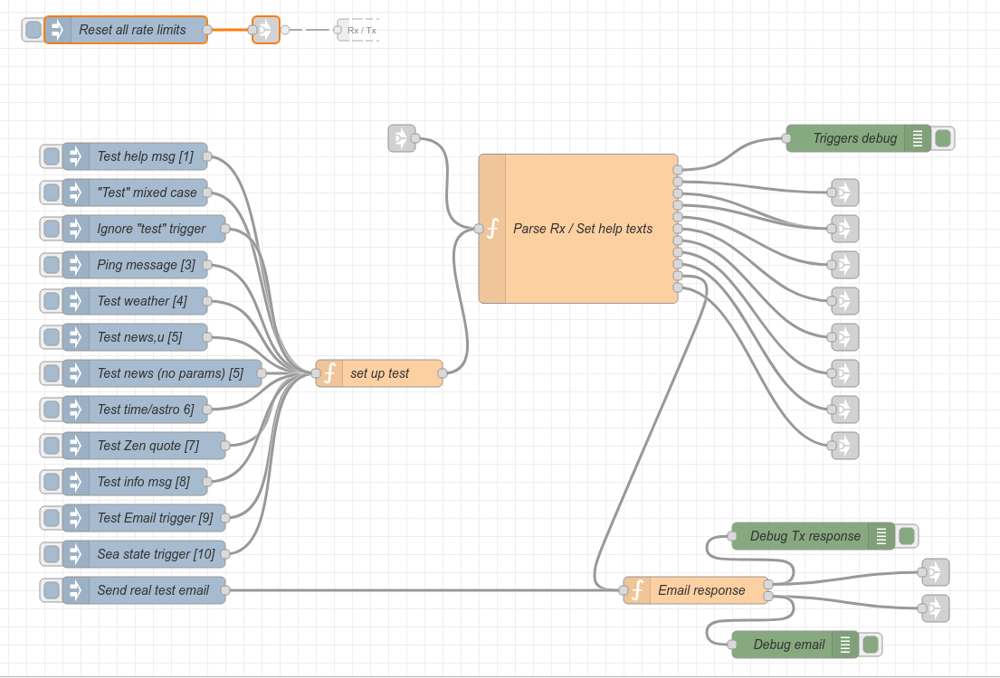
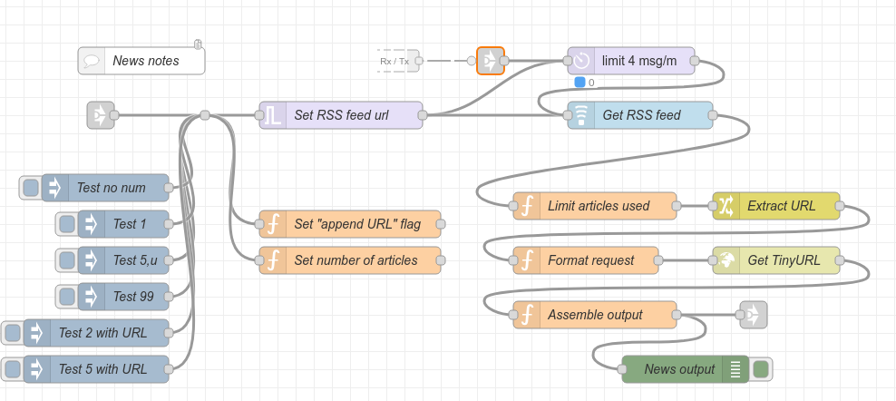
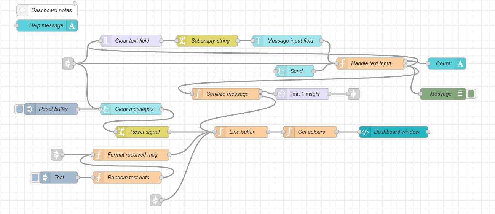

# MeshBop

A simple automated messaging service and Web-based terminal for Meshtastic, written as a set of Node-RED flows.

A 'weekend project' that got a bit out of hand!

---

## Table of Contents

- [Overview](#overview)
- [Features](#features)
- [What's New in v0.50 beta](#whats-new-in-v050-beta)
- [Prerequisites](#prerequisites)
- [Quick Start](#quick-start)
- [Hardware Setup](#hardware-setup)
- [Software Installation](#software-installation)
- [Configuration](#configuration)
- [Testing](#testing)
- [Upgrading](#upgrading)
- [Troubleshooting](#troubleshooting)
- [License](#license)
- [Disclaimer](#disclaimer)

---

## Overview

MeshBop is an easily extensible trigger/response messaging service for Meshtastic. It includes a web-based dashboard for sending and receiving messages, automated weather alerts, and customizable message triggers.

<div align="center">

</div>

---

## Features

### Default Message Triggers

Message triggers are activated using a short, definable prefix (example: `/abcd?` for help).

- **?** Help page
- **i** App info page
- **n** BBC RSS news feed
- **s** Sea state (v0.50 beta onwards)
- **t** Local time, sunrise and sunset
- **w** Local weather
- **z** Inspirational (Zen) message

### Additional Features

- **Automated Weather Alerts**: Checks UK Met Office every hour for severe weather warnings and broadcasts messages
- **Live Dashboard**: Web-based message send/receive interface with memory and scrollback
- **Auto-responses**: Responds to 'Test' and 'Ping' messages
- **Email Notifications**: Sends alerts to admin (optional)
- **Customizable**: All features can be disabled or modified individually
- **Rate Limiting**: Built-in protection against channel flooding

---

## What's New in v0.50 beta

This is a major rewrite. See [Upgrading](#upgrading) for migration instructions.

### Major Improvements

- **Simplified Configuration**: Most variables and messages now in centralized function nodes
- **Refactored Message Parsing**: Improved conditional handling and streamlined parsing
- **Enhanced Dashboard**: 
  - Character count for messages
  - Multi-line outbound messages
  - Larger history buffer
  - Optional display of MeshBop-generated messages
- **Better Message Handling**:
  - Improved chunking for long messages
  - Single pipeline to prevent out-of-order chunks
  - Automatic URL shortening with TinyURL
- **Improved Email System**: 
  - @trigger to email admin
  - Config export via email
- **Better Rate Limiting**: Consistent handling across all functions
- **Auto-compiling Help**: Help message is automatically compiled and sorted
- **More Debug Options**: Additional debug nodes throughout

### Bug Fixes

- Fixed message chunk ordering issues
- Improved handling of empty news/weather data
- Removed redundant ident messages after dashboard sends
- Better undefined global variable checking

---

## Prerequisites

### Hardware Requirements

**Required:**

- Linux compute device with accessible async serial port (GPIO pins, not USB)
  - - Examples: Raspberry Pi Zero 2W, Orange Pi Zero 3
- Meshtastic node with accessible async serial port
  - - Examples: Heltec V3, Seeed Xiao Meshtastic kit (ESP32 or NRF-based)
- Both devices must operate at **same logic levels** (typically 3.3V)
- A second Meshtastic node for sending and receiving test messages

### Software Requirements

- Node-RED
- Required Node-RED plugins (see [installation](#node-red-plugins))
- Meshtastic firmware with TEXTMSG enabled

### Network/Services

- WiFi connection for compute device
- Internet access for weather/news feeds
- Email account (optional, for notifications)

---

## Quick Start

1. Set up Raspberry Pi OS and connect to WiFi
2. Enable async serial port on Pi
3. Install Node-RED and required plugins
4. Configure Meshtastic node for TEXTMSG
5. Wire devices together (powered off!)
6. Import MeshBop flows
7. Configure settings
8. Test in private channel
9. Go live

---

## Hardware Setup

### Device Wiring Example

**IMPORTANT: Power off both devices before wiring!**

<div align="center">

</div>

**Connections:**

1. **GND/0V**: Pi GND ↔ Node GND (must be connected first)
2. **Serial (crossover)**:
   - Pi RX ↔ Node TX
   - Pi TX ↔ Node RX

**Note**: The RX/TX pins on your devices may vary. Check your specific board documentation.

### Development Board

The project was developed using:

- **Compute**: Raspberry Pi Zero 2W (and an Orange Pi Zero 3 for production)
- **Node**: Seeed Studios XIAO ESP32 + SX1262 (Heltec V3 for production)

---

## Software Installation

### 1. Raspberry Pi Setup

#### Install OS
1. Use Raspberry Pi Imager to install **Raspberry Pi OS Lite** (minimal) on SD card (8GB minimum)
2. Boot the Pi with display and keyboard connected

#### Connect to WiFi
```bash
nmcli device wifi list
nmcli device wifi connect "YourSSID" password "YourPassword"
```

[Reference: Jeff Geerling's nmcli guide](https://www.jeffgeerling.com/blog/2023/nmcli-wifi-on-raspberry-pi-os-12-bookworm)

#### Set Static IP (Optional but Recommended)
```bash
sudo nmcli con mod "Wired connection 1" ipv4.addresses 192.168.1.100/24
sudo nmcli con mod "Wired connection 1" ipv4.gateway 192.168.1.1
sudo nmcli con mod "Wired connection 1" ipv4.dns "9.9.9.9"
sudo nmcli con mod "Wired connection 1" ipv4.method manual
```
Use IP addresses to suit your network setup.

[Reference: RaspberryTips static IP guide](https://raspberrytips.com/set-static-ip-address-raspberry-pi/)

#### Enable Raspberry Pi Serial Port

Edit boot config:
```bash
sudo nano /boot/firmware/config.txt
```
Add at the end:
```
[all]
enable_uart=1
dtoverlay=uart0
dtoverlay=disable-bt
```

**Note**: Enabling UART requires disabling Bluetooth, as shown.

Reboot:
```bash
sudo reboot
```

**For Orange Pi Zero 3**: Use the ```orangepi-config``` utility to enable hardware UART5 (creates `ttyS5`).

### 2. Node-RED Installation

Run the official installation script:
```bash
bash <(curl -sL https://raw.githubusercontent.com/node-red/linux-installers/master/deb/update-nodejs-and-nodered)
```

When asked about installing the Pi-specific nodes, answer **Yes**.

[Reference: Node-RED Raspberry Pi Guide](https://nodered.org/docs/getting-started/raspberrypi)

#### Start Node-RED
```bash
sudo systemctl enable nodered.service
sudo systemctl start nodered.service
```

#### Verify Installation
```bash
sudo systemctl status nodered.service
```

Access Node-RED at: `http://[pi-ip-address]:1880`

### 3. Node-RED Plugins

Install these plugins via **Manage Palette** menu:

```
- @flowfuse/node-red-dashboard
- node-red-contrib-astrodata
- node-red-contrib-buffer-parser
- node-red-contrib-feedparser-simple
- node-red-node-email
- node-red-node-ping
- node-red-node-serialport
```

**Important**: Install **@flowfuse/node-red-dashboard** (Dashboard 2.0), not the legacy dashboard.

### 4. Meshtastic Node Configuration

#### Enable TEXTMSG Mode

Using the Meshtastic mobile app:

1. Connect to your node
2. Go to **Module Configuration** → **Serial**
3. Enable **Serial Module**
4. Set mode to **TEXTMSG**
5. Configure serial settings:
   - **Baud Rate**: 19200 (or match your setup)
   - **TX Pin**: Check your board pinout
   - **RX Pin**: Check your board pinout
6. **DO NOT** enable "Override Console Serial Port"
7. Save and reboot

<div align="center">

</div>

[Reference: Meshtastic Serial Module Docs](https://meshtastic.org/docs/configuration/module/serial/)

---

## Configuration

### 1. Import MeshBop Flows

This is the simplest method *for a first time install*. Upgrade notes are later.
#### Download Flow File
```bash
cd ~/Downloads
wget https://raw.githubusercontent.com/linker3000/MeshBop/main/meshbop-nnnnn.json
```

#### Import into Node-RED

1. Open Node-RED editor (`http://[pi-ip]:1880`)
2. Click **☰** (hamburger menu) → **Import**
3. Select downloaded JSON file or paste content
4. Click **Import**

**Note**: If you see warnings about unused configuration nodes, these can usually be ignored or deleted. They usually relate to a superfluous async port configuration.

### 2. Configure Serial Nodes (Raspberry Pi)

#### Async In Node
1. Locate the **Async in** node on the first tab
2. Double-click to edit
3. Set **Serial Port**: `/dev/ttyAMA0` (or `/dev/ttyS5` for Orange Pi)
4. Set **Baud Rate**: `19200`
5. Deploy

<div align="center">

</div>

#### Async Out Node
**Keep this DISABLED until all configuration is complete and tested!**

### 3. Main Configuration

#### Open Setup Function
On the **Main Setup** tab, find the large function node labeled "Setup Variables".

#### Configure Basic Settings

Edit the variables in the function using the included notes.

#### Review Each Tab

Go through each tab in sequence:

1. Read all comment nodes
2. Check function nodes for setup instructions
3. Customize messages as needed
4. Note any region-specific settings (weather, news feeds)

### 4. Email Configuration (Optional)

If using email notifications:

1. Find the email node on the **Email** tab
2. Configure SMTP settings:
   - Server
   - Port
   - Username
   - Password
   - From address

**Tip**: Use an app-specific password for Gmail accounts.

---

## Testing

### Testing Checklist

Before going live, complete these steps:

- [ ] All configuration variables set
- [ ] Serial Rx, Tx and ground connection between devices
- [ ] Private test channel created on Meshtastic
- [ ] Private channel set as PRIMARY (channel 0)
- [ ] Second device configured for the private channel too

### Create a Private Test Channel

**NOTE**: TEXTMSG mode sends/receives on the PRIMARY (first) channel only!

#### On the MeshBop Meshtastic Node:

1. Open Meshtastic app
2. Go to **Channels**
3. Create new channel with encryption
4. **Drag channel to be FIRST in the list**
5. Save and wait for reboot

<div align="center">

</div>

[Reference: Meshtastic Secondary Channels](https://meshtastic.org/docs/configuration/radio/channels/)

#### On Your Test Device:

1. Add the same private channel (can remain secondary)
2. Select it for messaging
3. Test connection

### Run Debug Tests

1. Use the **inject nodes** on the Main Setup tab to test each function
2. Check debug output for errors
3. Verify message formatting

### Enable Live Testing

1. **Enable the Async Out node**
2. Deploy changes
3. Send test messages from your test device - Examples:
   ```
   /l3k?    (help)
   /l3kt    (time)
   /l3kz    (zen quote)
   ping
   test
   ```
4. Verify responses appear on test device

### Go Live

When satisfied with testing:

**Option 1**: Keep private channel as primary (recommended for personal/group use)

**Option 2**: Reorder channels to make LongFast (public) primary
- **WARNING**: All MeshBop messages will then be sent on the public channel!
- Ensure there's no personal information in your messages
---

## Upgrading

For when you already have a set of MeshBop flows in Node-RED.

### Before You Begin

**BACKUP EVERYTHING**

These instructions assume MeshBop is the only set of flows in your Node-RED instance. Once the current flows have been backed up, they will be replaced with a new set and any customisations or non-MeshBop tabs will be removed.

#### Document Current Settings

1. Note all customizations in function nodes - copy the contents of any cutomised functions into a text editor and save them for future reference
2. Screenshot any modified flow wiring too
3. Export the current flows:
   - Click **☰** → **Export** → **All flows**
   - Click **Download**
   - Save as `meshbop-backup-[date].json`

### Upgrade Process

#### 1. Take MeshBop Offline

Disable the **Async Out** node or switch to a test channel.


#### 2. Check which user runs Node-RED
ps aux | grep node-red

**Note**: If Node-RED runs as different user (e.g., `nodered`), use that user name instead of 'pi' in the commands below:

#### 3. Stop Node-RED

```bash
sudo systemctl stop nodered.service
```

#### 4. Backup Node-RED Directory

This assumes that the 'pi' user is running Node-RED and so the application is setup below their home folder.
```bash
cd /home/pi/.node-red/
mkdir ~/node-red-backup-$(date +%Y%m%d)
cp flows_* settings.js ~/node-red-backup-$(date +%Y%m%d)/
```

**Files backed up:**
- `flows.json`
- `flows_cred.json`
- `settings.js`

#### 5. Download New Flows

```bash
cd ~/Downloads
wget https://raw.githubusercontent.com/linker3000/MeshBop/main/meshbop-nnnnn.json
```

#### 6. Replace Flows File

```bash
cp ~/Downloads/meshbop-nnnnn.json /home/pi/.node-red/flows.json
```

#### 7. Fix Ownership

```bash
sudo chown pi:pi /home/pi/.node-red/flows*.json
sudo chown pi:pi /home/pi/.node-red/settings.js
```
```bash
sudo chown nodered:nodered /home/nodered/.node-red/flows*.json
```

#### 8. Restart Node-RED

```bash
sudo systemctl start nodered.service
```

#### 9. Verify Startup

```bash
sudo systemctl status nodered.service
```
Or view logs:
```bash
node-red-log
```

#### 10. Reconfigure

1. Open Node-RED editor: `http://[pi-ip]:1880`
2. Review all tabs and comments
3. Reapply customizations from your notes
4. Test thoroughly before going live

### Upgrade Notes by Version

Will be here.

---

## Troubleshooting

### Serial Port Issues

**Problem**: Serial port stops responding

**Solution**:
```bash
sudo systemctl stop serial-getty@ttyAMA0.service
sudo systemctl disable serial-getty@ttyAMA0.service
sudo reboot
```

### Meshtastic Firmware Bug

**Problem**: Garbage data sent when node powers on

**Cause**: Known Meshtastic firmware issue (not a MeshBop bug)

**Workaround**: Ignore initial garbage. This clears after first proper message.

### Rate Limiting Blocking Messages

**Problem**: Messages not being sent during testing

**Solution**: Use the **Reset Rate Limiters** inject node on Main Setup tab

### Messages Going to Wrong Channel

**Problem**: Private messages appearing on public channel

**Cause**: Wrong channel set as primary

**Solution**: Verify private channel is **first** in channel list on MeshBop node

### Weather/News Not Working

**Problem**: No data returned from feeds

**Check**:
- Internet connection on Pi
- API keys configured (if required)
- Region-specific service availability
- Debug output for specific error messages

### Dashboard Not Loading

**Problem**: Dashboard page shows error or blank

**Check**:
- Correct Dashboard 2.0 plugin installed (@flowfuse/node-red-dashboard)
- Flows deployed after import
- Access correct URL: `http://[pi-ip]:1880/dashboard`

### Common Error Messages

**"Port not found"**
- Check `/dev/ttyAMA0` (or the async port on your compute board) exists: `ls -la /dev/tty*`
- Verify serial enabled in `/boot/firmware/config.txt` (Raspberry Pi)
- Reboot Pi

**"Permission denied"**
- Fix ownership: `sudo chown pi:pi /dev/ttyAMA0`
- Or add user to dialout group: `sudo usermod -a -G dialout pi`

**"Unused configuration nodes"**
- These are usually harmless (old serial port definitions)
- Search for and delete if desired

---

## Screenshots

Here's a few of the MeshBop flows:

### Main Setup Flow
<div align="center">

</div>

### Inbound Message Parser Flow
<div align="center">

</div>

### BBC RSS News Flow
<div align="center">

</div>

### Dashboard Flow
<div align="center">

</div>

---

## Support & Contributing

### Getting Help

- **Issues**: Use the GitHub Issues tab
- **Questions**: Check existing issues first
- **Bugs**: Provide Node-RED version, OS version, and error messages

All support and advice is given on a 'best effort' basis - there's no SLA here!

### Feedback Welcome

Contact: linker3000@gmail.com (replace -dot-thingy with .com)

---

## License

**Creative Commons Attribution-NonCommercial-ShareAlike 4.0 International (CC BY-NC-SA 4.0)**

```
Author: Linker3000 (Nigel Kendrick)

You are free to:
  - Share — copy and redistribute the material in any medium or format
  - Adapt — remix, transform, and build upon the material

Under the following terms:
  - Attribution — You must give appropriate credit
  - NonCommercial — You may not use the material for commercial purposes
  - ShareAlike — If you remix, transform, or build upon the material, 
    you must distribute your contributions under the same license

Full License: https://creativecommons.org/licenses/by-nc-sa/4.0/
```

---

## Disclaimer

### Project Disclaimer

**Meshtastic** is a registered trademark of Meshtastic LLC. This project is **not affiliated with, endorsed by, or officially connected with Meshtastic LLC** or the Meshtastic brand. The use of the Meshtastic name and trademark is solely for informational purposes and to indicate compatibility with the Meshtastic system.

MeshBop is independent and was developed by Linker3000 (Nigel Kendrick) and its contributors. Any opinions, views, or content shared here are those of the project creators and do not reflect the views or endorsement of Meshtastic LLC.

### Usage Disclaimer

- **Accuracy depends on your setup** and third-party services
- Supplied **"as is"** with no warranties
- **Use at your own risk**
- No responsibility for consequential loss or errors
- **Not an emergency service**
- Weather and sea state information is region-based and may need local adjustments

---

## Channel Behavior Note

>
> As of October 2025, Meshtastic firmware TEXTMSG mode:
> 
> - **SENDS** to the PRIMARY (first) channel only
> - **RECEIVES** from ANY channel
>
> **Implication**: A "private" MeshBop setup can receive spoofed messages from other channels, though the responses remain private. Use long, complex trigger patterns to reduce spoofing risk.
>
> **For private use**: Set your encrypted channel as PRIMARY (channel 0) on the MeshBop node.

---

## Additional Notes

### Notes for Non-Raspberry Pi Systems

**Docker**: Replace flow files in the container's mapped volume (usually `/data`)

**Custom Installations**: Service name/directory may differ. Check with:
```bash
sudo systemctl list-units | grep node
```

**Different Usernames**: Always confirm ownership with `ps aux | grep node-red` and adjust paths/permissions accordingly.

### Localisation

MeshBop was written in the UK and uses UK/EU services for news, weather and other information. These services may not be available in your country, or there may be better, local ones to use. If you replace any flows with regional versions, please export them and share here for others to enjoy.

### Performance Tips

- Use Pi OS Lite to maximize resources for Node-RED
- Consider fixed IP for easier access
- Regular backups recommended
- Monitor system resources during operation

### Defaults

- **Ident message**: Sent daily at 07:00
- **Weather alerts**: Checked hourly
- **Rate limits**: In place to protect the mesh network - please don't bypass

---

**Last Updated**: October 2025  
**Current Version**: 0.50 beta
